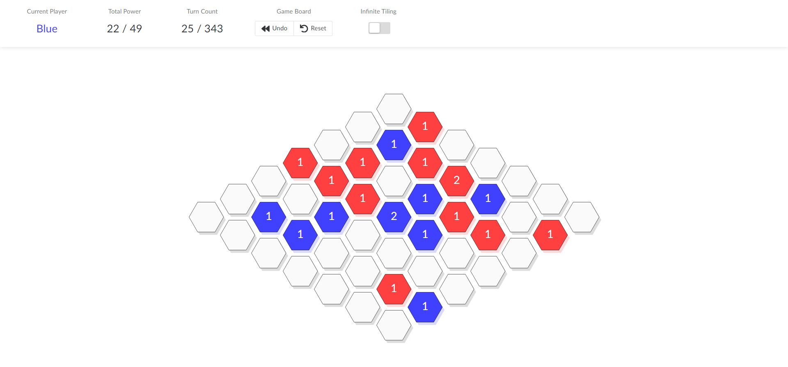

# Inflexion-Game-Playing-AI
This project was conducted as a team of 2 in the subject Artificial Intelligence at the University of Melbourne. The `report.pdf` file sufficiently outlines the scope of the project and our implementation. The `Different_Agents` folder contains all the agents we used and experimented with. The `skalB` folder contains the code for used for processing the board and game state. The `referee` can be used to actually run the game (this module was provided in the subject).  
